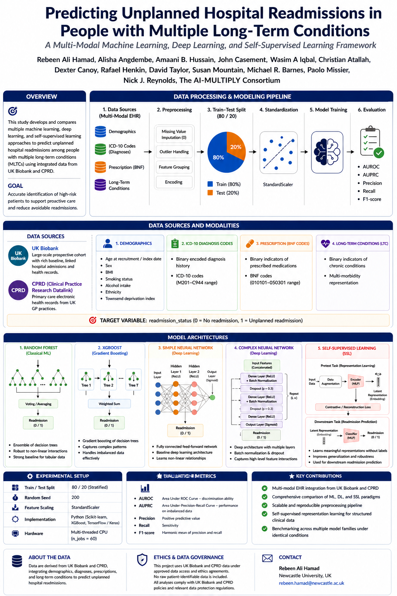

# Predicting Unplanned Hospital Readmissions in People with Multiple Long-Term Conditions

<p align="center">
  <em>A Multi-Modal Machine Learning, Deep Learning, and Self-Supervised Learning Framework</em>
</p>

<p align="center">
  
  
  
  
  
  
</p>

---

## 📌 Overview

This repository contains the complete machine learning and deep learning pipeline for the study:

> **"Predicting Unplanned Hospital Readmissions in People with Multiple Long-Term Conditions"**

The project develops and evaluates multiple predictive modelling approaches using large-scale **UK Biobank and CPRD (Clinical Practice Research Datalink)-derived electronic health record (EHR) data**, integrating demographic, diagnostic, prescription, and long-term condition (LTC) features across five model families — from classical ML to self-supervised representation learning.

### Key Features

- ✅ Multi-modal EHR integration (demographics, ICD-10, BNF, LTC)
- ✅ Multiple modelling paradigms benchmarked on the same cohort
- ✅ Scalable preprocessing pipeline with stratified train/test splitting
- ✅ Self-supervised representation learning for low-label settings
- ✅ Fully reproducible experiments with fixed random seeds
- ✅ Evaluation across AUROC, AUPRC, Precision, Recall, and F1

---
## Overview
<p align="center">
  
</p>
## 🖼️ Project Poster

<p align="center">
  
</p>

---

## 👥 Authors

Rebeen Ali Hamad · Alisha Angdembe · Amaani B. Hussain · John Casement · Wasim A. Iqbal · Christian Atallah · Dexter Canoy · Rafael Henkin · David Taylor · Susan Mountain · Michael R. Barnes · Paolo Missier · Nick J. Reynolds

*on behalf of **The AI-MULTIPLY Consortium***

---

## 🗂️ Repository Structure

```
Readmission_code/
│
├── data/                          # Raw TSV files (demographics, ICD-10, BNF, LTC, outcome)
│
├── xgboost_model/                 # XGBoost implementation
│   └── xgboost_model.py
│
├── random_forest_model.py         # Random Forest implementation
│
├── simple_neural_network/         # Baseline feedforward neural network
│   └── main.py
│
├── complex_neural_network/        # Deep architecture with batch norm & dropout
│   └── main.py
│
├── SSL_model/                     # Self-supervised representation learning framework
│   └── main.py
│
└── README.md
```

> Each model folder contains its own configuration and detailed usage instructions.

---

## 🧬 Data Sources & Modalities

This project uses two large-scale EHR datasets: **UK Biobank** for primary model development and **CPRD** as an independent replication dataset.

---

### 🔬 Dataset 1: UK Biobank *(Primary)*

Large-scale prospective cohort study with ~500,000 UK participants, providing linked primary care, hospital inpatient (HES), and mortality records. All modalities are linked via participant ID (`eid`).

| Modality | Description | Encoding |
|---|---|---|
| **Demographics** | Age at recruitment, sex, BMI, smoking status, alcohol intake, ethnicity, Townsend deprivation index | Continuous / one-hot |
| **ICD-10 Diagnosis Codes** | Binary-encoded diagnosis history (codes M201–C944 range) | Binary |
| **Prescription (BNF Codes)** | Binary indicators of prescribed medications (BNF codes 010101–050301 range) | Binary |
| **Long-Term Conditions (LTC)** | Binary indicators of chronic conditions; multi-morbidity representation | Binary |

> Access requires an approved application via the [UK Biobank Access Management System](https://www.ukbiobank.ac.uk/enable-your-research/apply-for-access).

---

### 🔁 Dataset 2: Clinical Practice Research Datalink — CPRD *(Replication)*

CPRD is a real-world research database of anonymised primary care EHR data from GP practices across the UK, used here to validate the generalisability of models trained on UK Biobank.

| Modality | Description | Encoding |
|---|---|---|
| **Demographics** | Age, sex, BMI, smoking status, deprivation index | Continuous / one-hot |
| **ICD-10 / Read Codes** | Diagnosis history mapped to ICD-10 equivalents | Binary |
| **Prescription records** | Medication history using BNF / product codes | Binary |
| **Long-Term Conditions (LTC)** | Chronic condition indicators derived from GP records | Binary |

> Access requires registration and approval via [CPRD](https://www.cprd.com/data-access).

---

### 🎯 Target Variable

```
readmission_status:  0 = No readmission
                     1 = Unplanned readmission
```

---

## ⚙️ Data Processing & Modelling Pipeline

```
 ┌──────────────┐    ┌─────────────┐    ┌──────────────────────────┐
 │ Raw TSV Files│───▶│ Merge by eid│───▶│      Preprocessing       │
 └──────────────┘    └─────────────┘    │  • Missing value impute  │
                                        │  • Outlier handling      │
                                        │  • Feature grouping      │
                                        │  • Encoding              │
                                        └────────────┬─────────────┘
                                                     │
                          ┌──────────────────────────▼──────────────────────────┐
                          │           Train–Test Split (80 / 20, stratified)    │
                          └──────────────┬──────────────────────────────────────┘
                                         │
                          ┌──────────────▼──────────────┐
                          │  Standardisation             │
                          │  (StandardScaler)            │
                          └──────────────┬───────────────┘
                                         │
                          ┌──────────────▼──────────────┐
                          │  Model Training              │
                          └──────────────┬───────────────┘
                                         │
                          ┌──────────────▼──────────────┐
                          │  Evaluation                  │
                          │  AUROC · AUPRC · P · R · F1  │
                          └─────────────────────────────┘
```

---

## 🤖 Model Architectures

### 1. 🌲 Random Forest *(Classical ML)*
- Ensemble of decision trees via voting/averaging
- Robust to non-linear interactions
- Strong baseline for high-dimensional tabular EHR data

### 2. ⚡ XGBoost *(Gradient Boosting)*
- Sequential gradient boosting of decision trees
- Captures complex, non-linear feature interactions
- Effective at handling class imbalance

### 3. 🧠 Simple Neural Network *(Baseline Deep Learning)*
- Fully connected feedforward network (MLP)
- Architecture: `Input → Hidden Layer 1 (ReLU) → Hidden Layer 2 (ReLU) → Output (Sigmoid)`
- Baseline deep learning reference

### 4. 🔬 Complex Neural Network *(Advanced Deep Learning)*
- Deep multi-layer architecture
- Batch Normalisation + Dropout (`p=0.3`) after each dense block
- Captures high-level feature interactions across modalities

### 5. 🔄 Self-Supervised Learning (SSL)
- **Pretext task:** Representation learning via contrastive / reconstruction loss
- **Downstream task:** Learned embeddings passed to MLP classifier
- Learns meaningful patient representations without full label dependency
- Improves generalisation and robustness, especially in data-scarce regimes

---

## 📊 Evaluation Metrics

| Metric | Description |
|---|---|
| **AUROC** | Area Under the ROC Curve — overall discrimination ability |
| **AUPRC** | Area Under the Precision-Recall Curve — performance on imbalanced classes |
| **Precision** | Positive predictive value |
| **Recall** | Sensitivity — proportion of true readmissions correctly identified |
| **F1-Score** | Harmonic mean of precision and recall |

---

## 🔬 Experimental Setup

| Setting | Value |
|---|---|
| Train / Test Split | 80 / 20 (Stratified) |
| Random Seed | 200 |
| Feature Scaling | `StandardScaler` |
| Implementation | Python (scikit-learn, XGBoost, TensorFlow / Keras) |
| Hardware | Multi-threaded CPU (`n_jobs=60`) |

---

## 🚀 Getting Started

### Prerequisites

- Python 3.9+
- Access to UK Biobank-derived data (approved application required)

### Installation

```bash
# Clone the repository
git clone https://github.com/rebeen/Readmission-Prediction-on-UK-BioBank-.git
cd Readmission-Prediction-on-UK-BioBank-/Readmission_code

# Create and activate a virtual environment
python -m venv venv
source venv/bin/activate        # Windows: venv\Scripts\activate

# Install dependencies
pip install -r requirements.txt
```

### Running the Models

**Classical ML — XGBoost (recommended):**
```bash
python xgboost_model.py
```

**Classical ML — Random Forest:**
```bash
python random_forest_model.py
```

**Simple Neural Network:**
```bash
cd "simple_neural_network"
python main.py
```

**Complex Neural Network:**
```bash
cd "complex_neural_network"
python main.py
```

**Self-Supervised Learning:**
```bash
cd "SSL_model"
python main.py
```

> Each model folder contains detailed configuration instructions.

---

## 🔒 Ethics & Data Governance

This project uses UK Biobank-derived data under approved data access and ethics agreements.

- **No raw patient-identifiable data is included** in this repository.
- All analyses comply with UK Biobank policies and relevant data protection regulations.
- Data access requires an approved application via the [UK Biobank Access Management System](https://www.ukbiobank.ac.uk/enable-your-research/apply-for-access).
- Researchers must not upload UK Biobank participant data to public repositories.

---

## 📄 Citation

If you use this repository, please cite our paper:

```bibtex
@article{hamad2024readmission,
  title   = {Predicting Unplanned Hospital Readmissions in People with
             Multiple Long-Term Conditions},
  author  = {Hamad, Rebeen Ali and Angdembe, Alisha and Hussain, Amaani B.
             and Casement, John and Iqbal, Wasim A. and Atallah, Christian
             and Canoy, Dexter and Henkin, Rafael and Taylor, David
             and Mountain, Susan and Barnes, Michael R. and Missier, Paolo
             and Reynolds, Nick J. and {The AI-MULTIPLY Consortium}},
  year    = {2024},
  note    = {Authors listed above. The AI-MULTIPLY Consortium.}
}
```

---

## 🙏 Acknowledgements

The authors gratefully acknowledge:

- The **UK Biobank** resource and all its participants
- The **AI-MULTIPLY Consortium** for collaborative support
- The open-source machine learning community

---

## 📬 Contact

**Rebeen Ali Hamad**  
Newcastle University, UK  
📧 [rebeen.hamad@newcastle.ac.uk](mailto:rebeen.hamad@newcastle.ac.uk)

---

<p align="center">
  <sub>This project is for research purposes only and is not intended for clinical deployment without further prospective validation.</sub>
</p>
